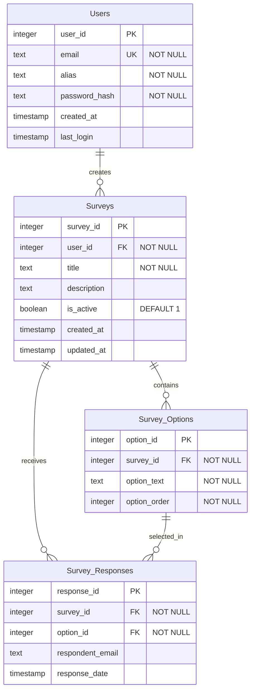

# 顧客調査アプリケーション データベース設計

このドキュメントでは、顧客調査アプリケーションのデータベース設計を図示します。

## エンティティリレーションシップダイアグラム

## テーブル関係の説明

1. **Users テーブル**
   - ユーザー情報を格納します
   - 一意のメールアドレスとエイリアス（表示名）を持ちます
   - パスワードはハッシュ化して保存されます

2. **Surveys テーブル**
   - アンケート情報を格納します
   - 各アンケートは一人のユーザーによって作成されます（user_id 外部キー）
   - 一人のユーザーは複数のアンケートを作成できます（1対多関係）

3. **Survey_Options テーブル**
   - アンケートの選択肢を格納します
   - 各選択肢は一つのアンケートに属します（survey_id 外部キー）
   - 一つのアンケートは2〜5つの選択肢を持ちます（1対多関係、制約あり）
   - option_orderは1から5の間の値を取ります

4. **Survey_Responses テーブル**
   - エンドユーザーからのアンケート回答を格納します
   - 各回答は一つのアンケートと一つの選択肢に関連付けられます（survey_id と option_id 外部キー）
   - 回答者のメールアドレスを任意で記録できます

## 制約

- アンケートの選択肢は2〜5つの間である必要があります
- 選択肢の順序は1から5の間である必要があります
- ユーザーが削除された場合、そのユーザーが作成したすべてのアンケートも削除されます（CASCADE）
- アンケートが削除された場合、そのアンケートに関連するすべての選択肢と回答も削除されます（CASCADE）